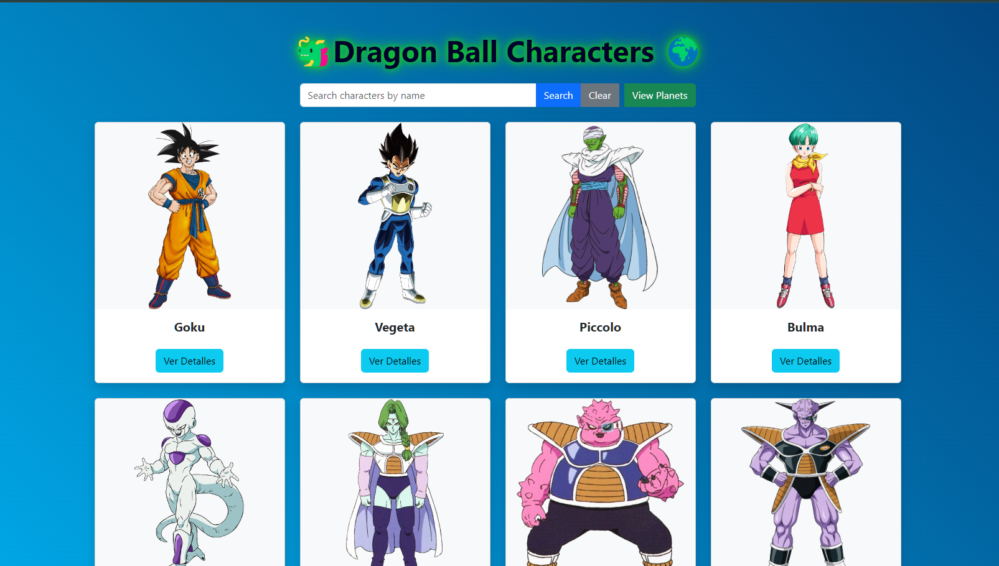
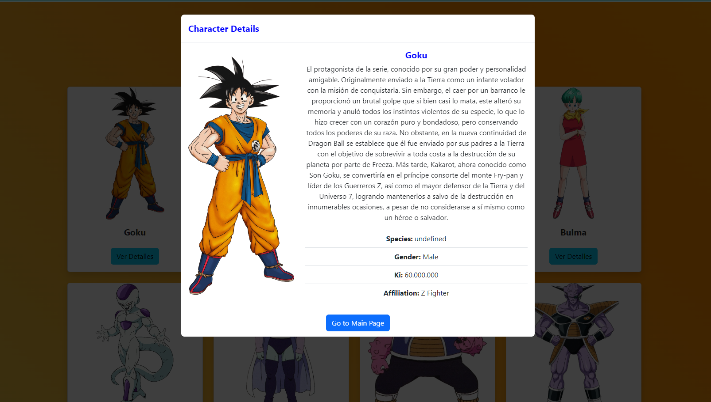
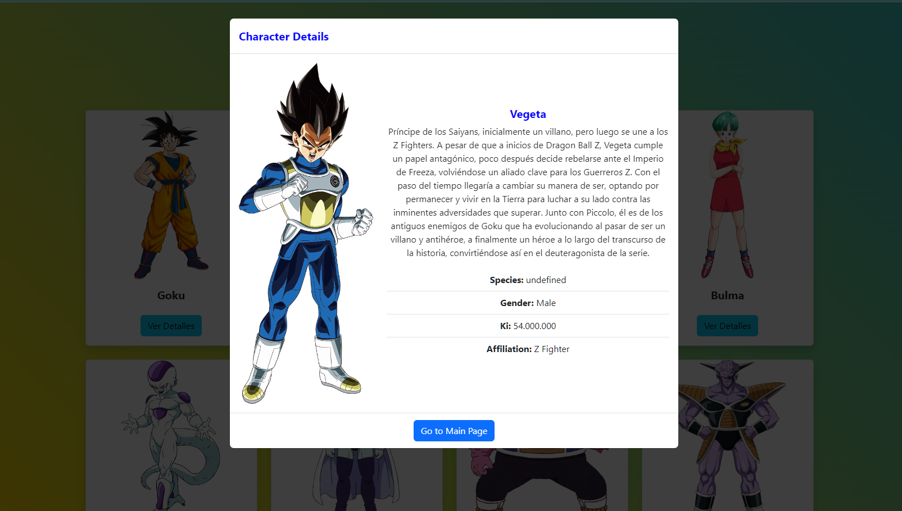
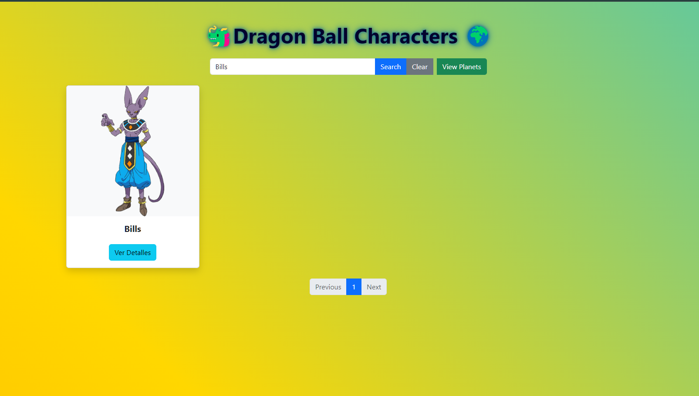
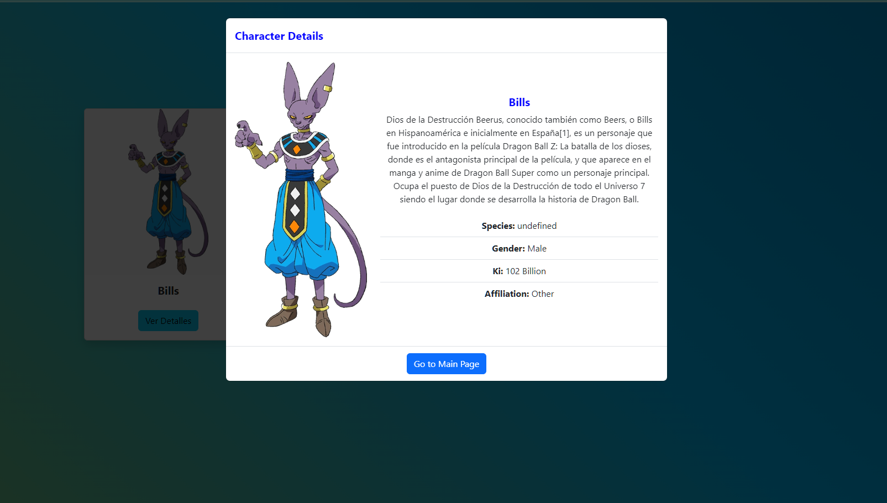
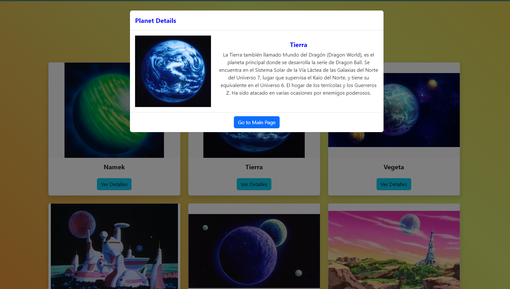

# Dragon Ball Project API Dragon Ball Z

Este proyecto muestra información sobre los personajes y planetas del universo Dragon Ball. Está diseñado con HTML, CSS y JavaScript utilizando Bootstrap para el estilo y la funcionalidad de los modales y paginación.

## API de Dragon Ball

El proyecto utiliza la [Dragon Ball API](https://web.dragonball-api.com/documentation), una API pública que proporciona datos detallados sobre personajes, planetas, y más del universo Dragon Ball. Esta API es una excelente herramienta para acceder a información rica y variada, lo que permite integrar contenido relevante y actualizado en tus aplicaciones y proyectos.

### Recursos Disponibles en la API

La API de Dragon Ball ofrece los siguientes recursos:

- **Personajes**: Información sobre los personajes principales y secundarios, incluyendo detalles como nombre, imagen, descripción, y atributos específicos.
- **Planetas**: Datos sobre los planetas del universo Dragon Ball, con información visual y descriptiva.
- **Otras Entidades**: Dependiendo de la versión de la API, también puede ofrecer información sobre otras entidades relevantes.

### Documentación

Puedes consultar la documentación completa de la API en [Dragon Ball API Documentation](https://web.dragonball-api.com/documentation) para obtener detalles sobre los endpoints disponibles, ejemplos de uso, y parámetros necesarios para realizar solicitudes.


## Características

- **Página de Personajes (`index.html`):** Muestra una lista de personajes de Dragon Ball. Cada personaje tiene una tarjeta con su imagen, nombre y un botón para ver detalles en un modal.
- **Página de Planetas (`planets.html`):** Muestra una lista de planetas de Dragon Ball. Cada planeta tiene una tarjeta con su imagen y nombre, y un botón para ver detalles en un modal.
- **Búsqueda y Paginación:** Ambas páginas incluyen funcionalidad de búsqueda y paginación para filtrar y navegar por los personajes y planetas.

## Galería

| Imagen 1 | Imagen 2 | Imagen 3 |
|:---------:|:---------:|:---------:|
|  |  |  |
| Portada 1 | Portada 2 | Portada 3 |

| Imagen 4 | Imagen 5 | Imagen 6 |
|:---------:|:---------:|:---------:|
|  |  |  |
| Portada 4 | Portada 5 | Portada 6 |


## Estructura del Proyecto

El proyecto está compuesto por los siguientes archivos:

- `index.html`: Página principal que muestra la lista de personajes.
- `planets.html`: Página secundaria que muestra la lista de planetas.
- `styles.css`: Archivo CSS que contiene los estilos personalizados.
- `script.js`: Archivo JavaScript que maneja la lógica de la aplicación.

## Instalación y Uso

Para ejecutar el proyecto localmente, sigue estos pasos:

1. Clona el repositorio:
   ```bash
   git clone https://github.com/tu_usuario/dragon-ball-project.git
   ```

2. Navega al directorio del proyecto:
   ```bash
   cd dragon-ball-project
   ```

3. Abre `index.html` y `planets.html` en tu navegador web.

## Descripción de los Archivos

### `index.html`
- **Descripción:** Muestra una lista de personajes.
- **Modales:** Utiliza un modal para mostrar detalles del personaje cuando se hace clic en el botón "Ver Detalles".
- **Búsqueda y Paginación:** Incluye funcionalidad de búsqueda y paginación para filtrar y navegar por los personajes.

### `planets.html`
- **Descripción:** Muestra una lista de planetas.
- **Modales:** Utiliza un modal para mostrar detalles del planeta cuando se hace clic en el botón "Ver Planeta".
- **Búsqueda y Paginación:** Incluye funcionalidad de búsqueda y paginación para filtrar y navegar por los planetas.

## API Utilizada

- **Dragon Ball API:** Proporciona datos sobre personajes y planetas de Dragon Ball.

## Contribuciones

Las contribuciones al proyecto son bienvenidas. Si deseas contribuir, por favor sigue estos pasos:

1. Haz un fork del repositorio.
2. Crea una nueva rama (`git checkout -b feature/nueva-caracteristica`).
3. Realiza tus cambios y confirma (`git commit -am 'Añadir nueva característica'`).
4. Empuja tus cambios (`git push origin feature/nueva-caracteristica`).
5. Crea una nueva solicitud de extracción (pull request).

## Licencia

Este proyecto está bajo la Licencia MIT. Consulta el archivo LICENSE para más detalles.

## Contacto

Para preguntas o comentarios, por favor contacta a [tu correo electrónico].
